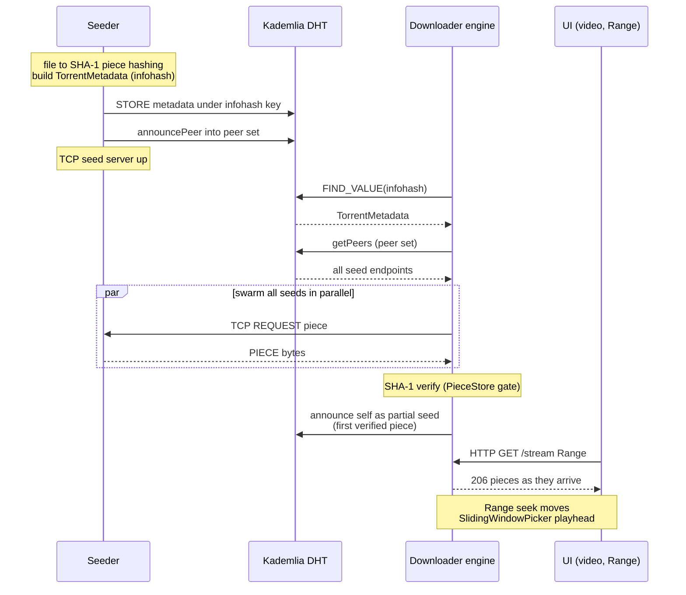
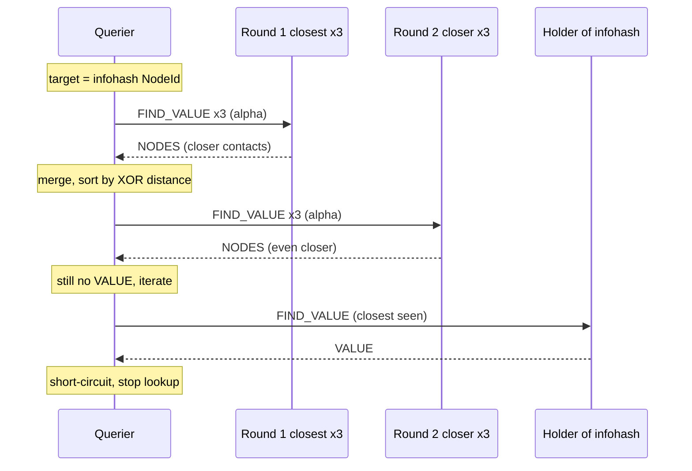
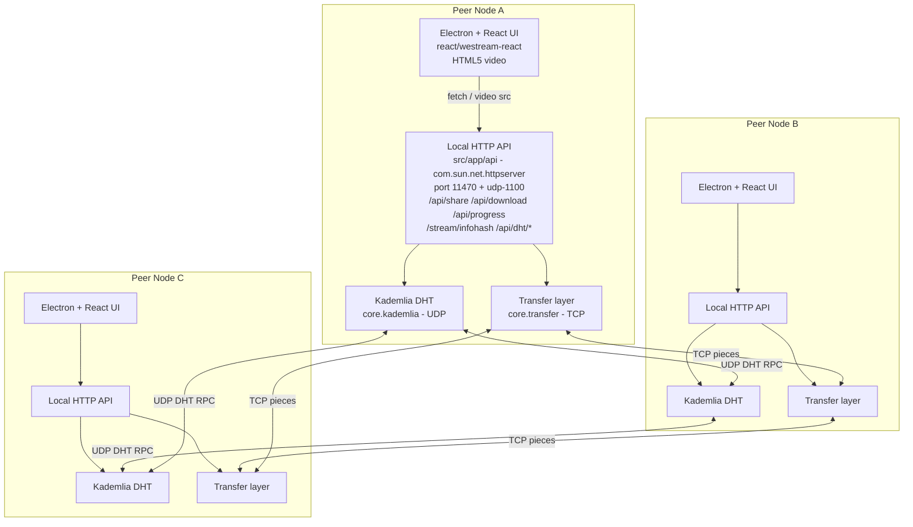
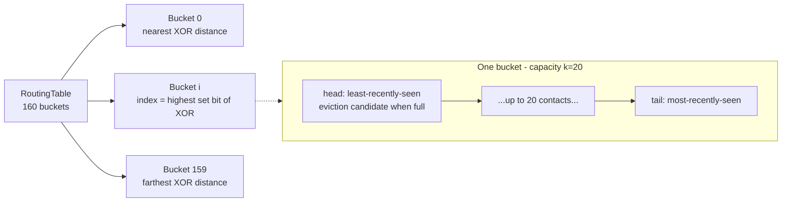

<div align="center">

# weStream

**A from-scratch BitTorrent downloader + Popcorn-Time-style streaming player — a "Mini Stremio" built on a hand-written Kademlia DHT.**


</div>

weStream is an academic P2P project (RAF, KIDS course) that builds a peer-to-peer media engine from the ground up. Its core is a **hand-written Kademlia distributed hash table** — 160-bit XOR-distance node IDs, k-buckets, iterative lookups, and the four classic RPCs — implemented in **pure JDK with zero third-party dependencies**, because that is where the learning lives. On top of the DHT rides a **BitTorrent-style transfer layer** (piece hashing, swarming, pipelined requests) and an **HTTP streaming endpoint** that lets you watch a video while it is still downloading. The whole thing is driven by an **Electron + React** desktop UI, one window per peer.

---

## The app

weStream is an Electron + React desktop client over a hand-written Kademlia DHT and BitTorrent-style transfer engine. The screenshots below walk from everyday use to the engine's glass box — where you can watch the P2P internals work in real time.

### Library


The landing screen: a "Continue watching" hero (Tears of Steel, 42:13 of 1:32:55) and a grid of the files this node is seeding, each annotated with its live peer count. The top bar reflects real engine state — "DHT CONNECTED," 24 peers, and live down/up throughput — so the home screen is itself a window into the swarm.

### Now Playing


The watch-while-download centerpiece: an HTML5 `<video>` surface streaming 2160p HEVC straight from the swarm (infohash `9f2ac081`), buffered 6.2s ahead. Under the scrubber, a live Sliding-window strip (the `SlidingWindowPicker`, W=32) colors pieces as have / in-flight / missing around the playhead, while a "Live swarm" rail shows which peers are feeding you and how fast.

### Swarm map


A radial view of the swarm with this node ("YOU") at the center and its ~24 peers around it — dashed links distinguish active transfers from merely known contacts. The stat cards (Connected peers 24, health Excellent, 11.4 MB/s down, 3.2 MB/s up, share ratio 1.84) are computed live from the routing table, not mocked.

### Add Stream


The torrent-style add flow: paste an infohash and "Resolve" fires a live `FIND_VALUE` into the DHT, returning "VALUE · 24 seeds" and a resolved card (256 KB piece size, 6,812 pieces, 1.74 GB) ready to Stream or Download. The drag-to-share dropzone runs the reverse path — SHA-1 hashing the file into 256 KB pieces and announcing you as its first seed in the DHT.

### DHT Inspector


The engine's glass box, showing the hand-written Kademlia at work: this node's 160-bit SHA-1 ID, seed status and uptime, and live counts (11/160 buckets, 38 contacts, 7 stored keys). A k-bucket bar chart (b159…b149), a streaming RPC feed (`FIND_VALUE` / `VALUE` / `FIND_NODE` / `STORE` / `PING`, with timestamps and timeouts), and a Stored-keys panel (infohash → seed metadata + TTL) make the routing internals fully observable.

---

## Features

**DHT engine (pure JDK, zero dependencies)**
- Hand-written **Kademlia** routing: 160-bit `NodeId`, XOR distance metric, k-buckets (k=20, least-recently-seen eviction)
- Iterative `nodeLookup` with α=3 parallel rounds; iterative `FIND_VALUE` that short-circuits on the first holder
- Four RPCs over UDP — `PING` / `FIND_NODE` / `STORE` / `FIND_VALUE` — with a hand-rolled, length-prefixed binary codec (no Java serialization on peer input)
- Hardened against hostile input: wire-source routing (anti-spoof), bounds-checked codec, capped + LRU-bounded local store, single-target RPC retry

**BitTorrent-style swarming**
- SHA-1 piece hashing with a per-piece verification gate; bit-packed thread-safe bitfield
- Persistent peer connections (one socket per peer) with pipelined `REQUEST`s over TCP
- **Multi-peer swarming (BEP 5)**: metadata under the infohash key, an accumulating TTL'd peer set under a derived key; downloads connect to **all** seeds in parallel
- A downloader joins the swarm as a **partial seed** on its first verified piece and re-announces periodically
- Two piece pickers: **rarest-first** for bulk downloads, **sliding-window** for streaming

**Streaming (watch-while-download)**
- HTTP **Range / 206** endpoint streams video as pieces arrive — no need to wait for the full file
- A Range seek moves the sliding-window picker's **playhead**, so pieces near where you are watching get priority

**Desktop UI**
- **Electron + React (Vite)** — one window per peer node, talking to the Java engine over a pure-JDK local HTTP API
- HTML5 `<video>` plays the live stream
- Live screens: DHT inspector (identity / k-buckets / counts), swarm view, add-stream, player with a live piece strip, library, and a live DHT RPC log

---

## How it works

**Sharing.** When a peer shares a file, the transfer layer splits it into pieces and computes a SHA-1 hash per piece. Those hashes (plus piece size and length) are folded into an **infohash** — the file's content address. The sharer `STORE`s the metadata in the DHT under the infohash key and **joins the swarm** by announcing itself into the TTL'd peer set under a derived key.

**Discovery.** Another peer, given only the infohash, resolves the metadata with an iterative `FIND_VALUE` across the DHT, then calls `getPeers` to fetch the current swarm — every seed that has announced itself for that infohash.

**Downloading.** The downloader opens persistent TCP connections to **all** discovered seeds in parallel and pulls pieces with pipelined requests. Every piece is checked against its SHA-1 hash before being accepted — the verification gate. On its first verified piece, the downloader announces itself into the swarm too, becoming a partial seed for everyone else.

**Streaming.** Instead of waiting for the whole file, the UI points an HTML5 `<video>` at the engine's HTTP `/stream` endpoint, which serves **Range / 206** responses filled in as pieces arrive. Seeking issues a new Range request that moves the **sliding-window picker's playhead**, so the pieces just ahead of the viewer are fetched first.

End-to-end path: a seeder hashes pieces and announces metadata plus itself into the DHT peer set; a downloader resolves the metadata, swarms all seeds in parallel over TCP, verifies each piece, and joins the swarm — while the UI streams it watch-while-download over an HTTP Range request.



### Kademlia iterative lookup (FIND_VALUE)

A lookup queries the α=3 closest contacts each round, follows the closer NODES it gets back toward the target by XOR distance, and short-circuits the moment any contact returns VALUE.



---

## Architecture

Per-peer full stack — Electron + React UI over a local JDK HTTP API, fronting the Kademlia DHT and Transfer engine — with nodes meshing over UDP (DHT RPC) and TCP (piece transfer).



### Kademlia routing table (k-buckets)

The routing table is 160 buckets indexed by XOR-distance bucket index (highest set bit); each bucket holds up to k=20 contacts, least-recently-seen at the head as the eviction candidate when full.



---

## Getting started

### Prerequisites
- **JDK 21+** (the engine, app, and HTTP API are plain JDK)
- **Node.js + npm** (for the Electron + React UI)

### 1. Compile the engine

Run from the repo root:

```bash
javac -d out/production/weStream $(find src -name '*.java')
```

On **Windows / PowerShell**, the `$(find …)` glob does not work — use:

```powershell
javac -d out/production/weStream (Get-ChildItem -Recurse src -Filter *.java).FullName
```

### 2. Run the live UI (node 0)

```bash
cd react/westream-react
npm install
npm run app:dev
```

Electron auto-spawns the Java engine for this window and talks to it over the local HTTP API — **one Electron window = one peer node**. Node 0 is the seed (UDP port 1100, API port 11470).

### 3. Run a second peer (node 1)

```bash
WS_NODE_ID=1 npm run app:dev
```

On **Windows / PowerShell**:

```powershell
$env:WS_NODE_ID=1; npm run app:dev
```

Node 1 listens on API port 11570. The API port for any node is `11470 + (udpPort - 1100)`.

> **Note:** Compile the engine (step 1) before launching the UI — Electron spawns the JVM from the compiled classes in `out/production/weStream`.

---

## Running the checks

`check.sh` is the single validation entry point. It compiles `src` + `test` and runs all three pure-JDK regression suites, exiting non-zero on any failure (so it drops straight into a git hook or CI):

```bash
./check.sh
```

On **Windows**, run it through Git Bash:

```bash
bash check.sh
```

It runs **69 Kademlia + 56 transfer + 78 API checks** over real UDP, TCP, and HTTP sockets — all with zero third-party dependencies.

---

## Project layout

| Path | What it is |
|------|------------|
| `src/core/kademlia/` | The Kademlia DHT engine — identity, routing, k-buckets, lookup, RPC, transport (**pure JDK**) |
| `src/core/transfer/` | BitTorrent-style transfer layer — piece model, bitfield, wire codec, peer connections, pickers, sessions (**pure JDK**) |
| `src/app/api/` | Local HTTP API over `com.sun.net.httpserver` (status, DHT, share/download, progress, `/stream`) |
| `react/westream-react/` | The live **Electron + React (Vite)** UI — one window per peer |
| `test/` | The `check.sh` regression suites (`KademliaCheck`, `TransferCheck`, `ApiCheck`) |
| `kademlia/` | Live config (`servent_list.properties`) + the multi-node simulation's input/output dirs |

**Dormant reference dirs (kept, not the live path):** `chord/` and the Chord classes under `src` are the original course DHT, still compiling but never started; `ui/` is an earlier JavaFX UI attempt, superseded by the Electron + React app.

---

## What's hand-rolled (the learning goal)

The zero-dependency rule is a deliberate, import-level boundary: **nothing under `core.kademlia` or `core.transfer` imports anything outside the JDK.** This is where the project's learning lives, and `./check.sh` enforces it via plain `javac`. Implemented by hand from the JDK alone:

- the **XOR distance metric** and k-bucket assignment by highest-set-bit
- **k-buckets** with least-recently-seen eviction
- **iterative node lookup** (α=3) and iterative `FIND_VALUE`
- the **sliding-window** and **rarest-first** piece pickers
- both **wire codecs** — length-prefixed binary framing for UDP RPC and TCP piece transfer (never Java serialization on untrusted bytes)

The JDK covers everything needed: `java.util.concurrent`, `java.security.MessageDigest` (SHA-1 IDs), and `java.net` (UDP for RPC, TCP for transfer). The UI, HTTP API, and packaging layers may use modern libraries freely — hand-rolling is a virtue only inside the engine.

---

## Tech stack

| Layer | Technology |
|-------|------------|
| DHT engine + transfer | **Java (pure JDK)** — UDP for RPC, TCP for piece transfer; zero third-party deps |
| Local API | **`com.sun.net.httpserver`** (JDK) — status, DHT put/get, share/download, progress, `/stream` (Range/206) |
| Desktop UI | **Electron** + **React** + **Vite**, HTML5 `<video>` |

---

## Status & roadmap

**Phases 1–5 are done.** The Kademlia engine, the BitTorrent-style transfer layer with multi-peer (BEP 5) swarming, the local HTTP API, and the live Electron + React UI with watch-while-download streaming are all functional and verified by `./check.sh` (69 + 56 + 78 checks).

**Remaining work** is native packaging — bundling the app with `electron-builder` (or `jpackage` / `jlink`) and a bundled JRE for the spawned Java engine. A handful of robustness improvements (e.g. download resume, choking/unchoking, overlapping lookup rounds) are tracked as known, deliberately deferred gaps.
