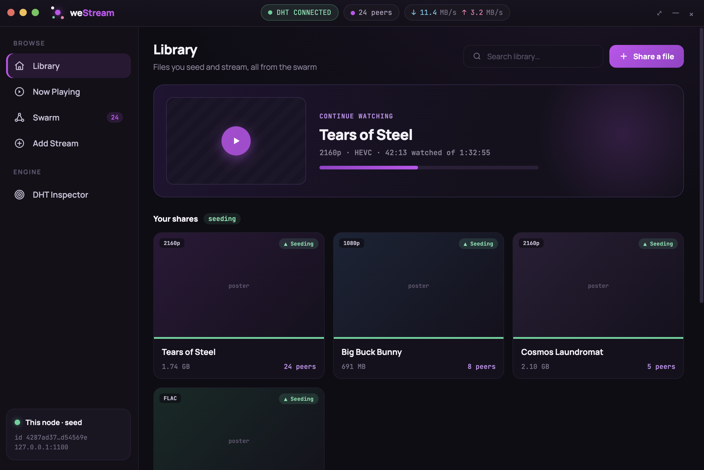
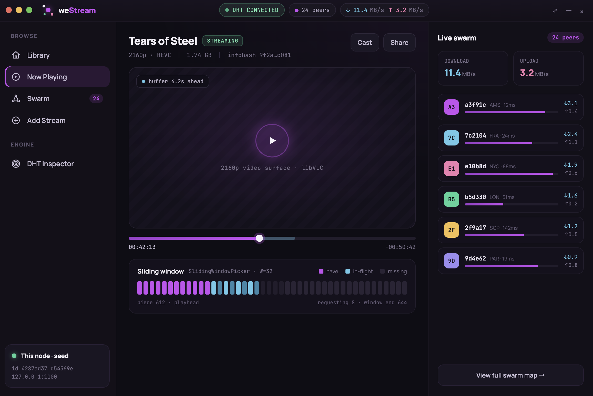
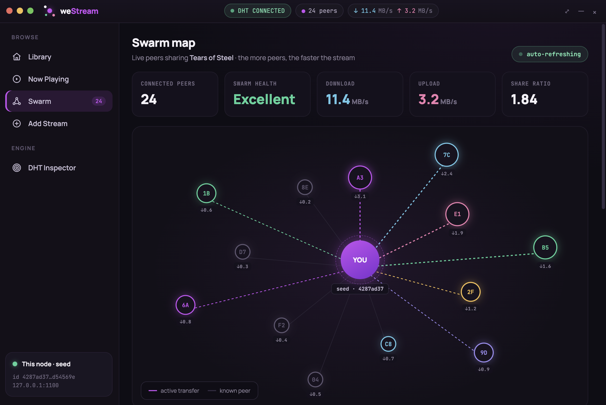
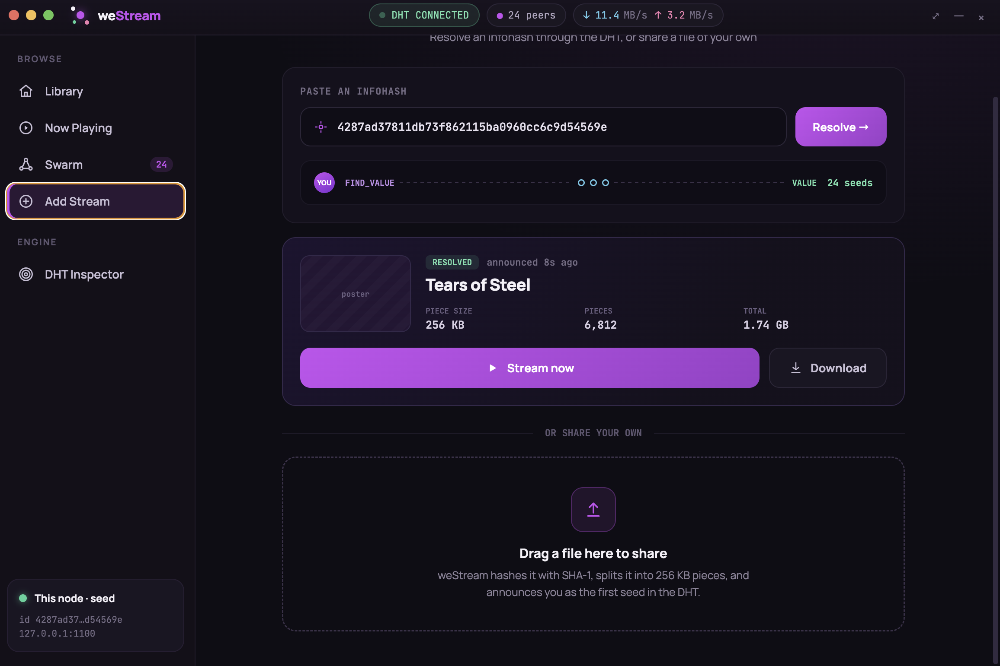
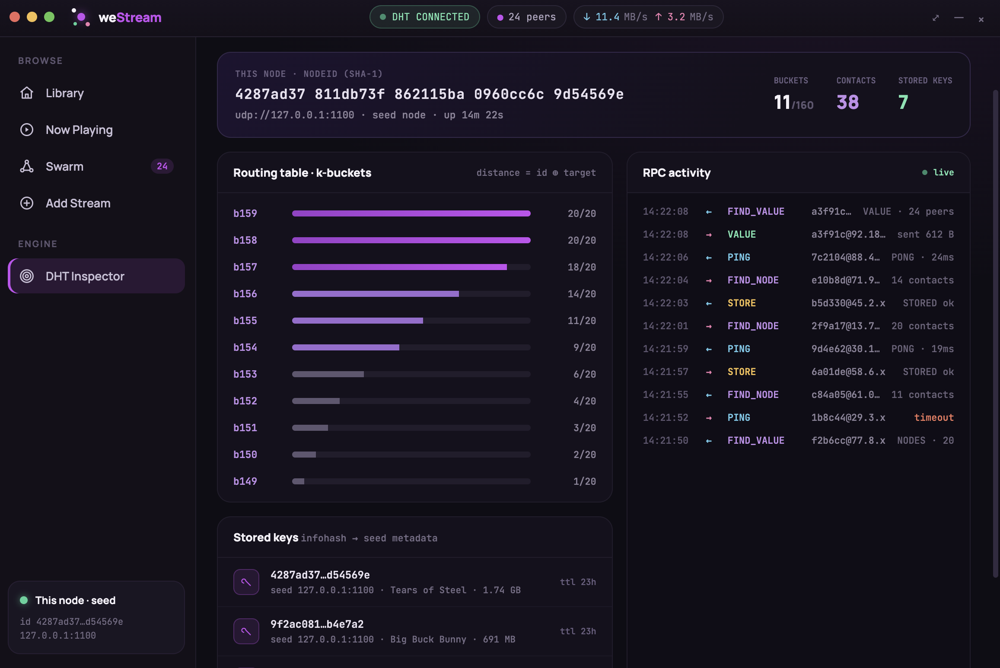
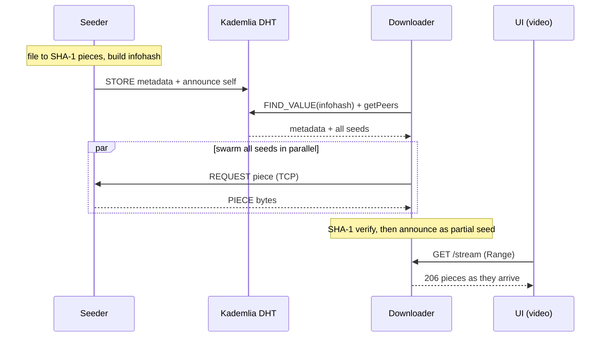

<div align="center">

# weStream

**A from-scratch peer-to-peer file downloader + streaming player on a hand-written Kademlia DHT.**


</div>

weStream splits a file into SHA-1 pieces, announces it in a **hand-written Kademlia DHT** (160-bit XOR IDs, k-buckets, iterative lookups, four RPCs over UDP), and lets peers swarm-download it from every seed in parallel over TCP — while you **watch the video as it downloads**. The DHT and transfer engine are **pure JDK, zero third-party dependencies**; the UI is Electron + React, one window per peer.

## The app

| | |
|---|---|
|  | **Library** — landing screen with a "Continue watching" hero and the files this node is seeding, each with a live peer count. |
|  | **Now Playing** — HTML5 `<video>` streaming straight from the swarm, with a live sliding-window piece strip (have / in-flight / missing) under the scrubber. |
|  | **Swarm map** — a radial view of every connected peer, with live throughput and share ratio computed from the routing table. |
|  | **Add Stream** — paste an infohash to resolve it via a live `FIND_VALUE`, or drag a file in to hash and announce it as a new seed. |
|  | **DHT Inspector** — the engine's glass box: node ID, k-bucket bars, a live RPC feed, and the local stored keys. |

## How it works



- **Share** → split into pieces, SHA-1 each, fold into an infohash, `STORE` metadata + join the swarm.
- **Discover** → resolve the infohash with an iterative `FIND_VALUE`, then `getPeers` for the live swarm.
- **Download** → connect to all seeds in parallel, pull pieces with pipelined requests, verify each against its hash, then announce yourself as a partial seed.
- **Stream** → `<video>` points at `/stream` (HTTP Range/206); seeking moves the sliding-window picker's playhead so pieces near the playhead are fetched first.

## Quick start

**Just try it (Windows).** Download `weStream-Setup.exe` from the **[latest release](../../releases/latest)** and run it — no Java needed, a JRE is bundled. The app opens as a seed: on **Add Stream** pick a video to share, then watch it stream back on **Now Playing**.

**See the P2P swarm.** Clone the repo, compile the engine once, then just double-click the launchers in `launchers/` — one window per peer:

```powershell
javac -d out/production/weStream (Get-ChildItem -Recurse src -Filter *.java).FullName
```

| Double-click | Peer |
|---|---|
| `launchers\run-node0-slow.cmd` | seed 0 — throttled so the sliding window is visible |
| `launchers\run-node1.cmd` | a downloader (also `run-node2` / `run-node3`) |

Each launcher sets up Java, builds the UI on first run, and opens that node. Share a file on node 0, copy its infohash, paste it on node 1 → **Watch now**, and watch it stream from the swarm.

> **One machine for now** — every node is on `127.0.0.1`, so two *separate computers* won't find each other yet (cross-machine bootstrap is deferred). Several peers on one box swarm in real time.

## Build from source (dev)

**Prerequisites:** JDK 21+ and Node.js + npm.

```bash
# 1. compile the engine (from repo root)
javac -d out/production/weStream $(find src -name '*.java')

# 2. run the live UI — one Electron window = one peer node (node 0 = seed)
cd react/westream-react && npm install && npm run app:dev

# 3. run a second peer
WS_NODE_ID=1 npm run app:dev
```

Electron auto-spawns the Java engine per window. The API port for a node is `11470 + (udpPort - 1100)` (node 0 → 11470, node 1 → 11570).

> Windows / PowerShell: the `$(find …)` glob differs — use `(Get-ChildItem -Recurse src -Filter *.java).FullName`; run checks with `bash check.sh`.

## Checks

```bash
./check.sh   # compiles src + test, runs 69 + 56 + 78 checks over real UDP/TCP/HTTP, zero deps
```

## Layout

| Path | What it is |
|------|------------|
| `src/core/kademlia/` | Kademlia DHT engine — IDs, routing, k-buckets, lookup, RPC (**pure JDK**) |
| `src/core/transfer/` | Peer-to-peer piece transfer — pieces, bitfield, wire codec, pickers (**pure JDK**) |
| `src/app/api/` | Local HTTP API (`com.sun.net.httpserver`) — share/download/progress/`/stream` |
| `react/westream-react/` | Electron + React UI |
| `test/` | The `check.sh` regression suites |

The DHT and transfer engine stay pure JDK by design — XOR metric, k-buckets, iterative lookup, piece pickers, and both wire codecs are all hand-written. The UI and API layers may use modern libraries.

## Status

Engine, multi-peer swarming, HTTP API, the Electron + React UI with watch-while-download streaming, and a **native Windows installer** (electron-builder + a bundled jlink JRE, published to GitHub Releases on a `v*` tag) are all done and verified by `./check.sh`. Deferred robustness items remain (download resume, choking/unchoking) and cross-machine peering (a real bootstrap address + NAT traversal).
